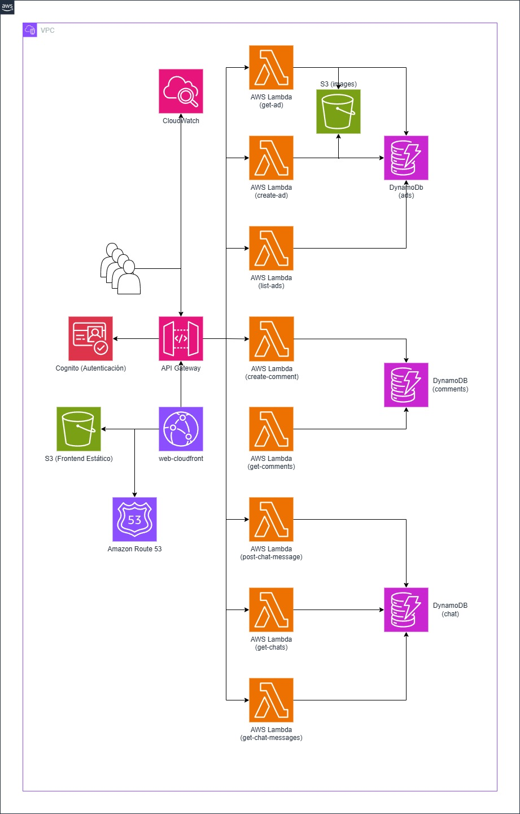

# Diseño e implementación de una web de anuncios en AWS

Este repositorio muestra el backend de una aplicación serverless de una web de publicación de anuncios utilizando servicios de AWS.

## Manual de despliegue

Se ha intentado automatizar el despliegue de la aplicación. Para ello hay que previamente preparar el entorno. Los siguientes pasos guian para desplegar la aplicación desde cero en AWS usando el <strong>framework Serverless Framework</strong>. El objetivo es levantar crear la infraestructura necesaria en AWS (con S3, DynamoDB, Lambda, API Gateway, etc.) y desplegar la aplicación serverless de manera eficiente.
1) Instalación de AWS CLI (si no se ha instalado previamente):
```bash
pip install awscli
```

2) Confirmación de que la instalación de ha realizado correctamente:
```bash
aws --version
```

3) Instalación del plugin Serverless Framework:
```bash
npm install -g serverless
```

4) Configuración de la consola AWS CLI con los correspondientes datos de la cuenta de AWS que se va a utilizar:
```bash
aws configure
```

5) A continuación debverán introducirse los siguientes datos que se encuentran en la cuenta de AWS:
- Access Key
- Secret Key
- Región de AWS donde se quiere trabajar

6) Creación de un proyecto con Serverless Framework y navegación al nuevo directorio:
```bash
mkdir aws-serverless25
cd aws-serverless25
```

7) Inicialización del proyecto de serverless
```bash
serverless create --template aws-python3 --path aws-serverless25
cd aws-serverless25
```

8) Instalación de dependencias en la raíz del proyecto. Se recomienda instalar cualquier dependencia adicional que se pueda necesitar, por ejemplo, el SDK de AWS para Python (boto3):
```bash
pip install boto3
```

6) Despliegue de la aplicación en AWS. Ejecución de la siguiente comando desde la raíz del proyecto. Esto desplegará todos los recursos definidos en serverless.yaml (las funciones Lambda, las tablas DynamoDB, los buckets S3, etc.) en AWS.:
```bash
serverless deploy
```
8) Una vez que el despliegue haya terminado, Serverless Framework proporcionará una URL pública para acceder a las funciones Lambda a través de API Gateway.
   
## Arquitectura General
Se ha tratado de utilizar servicios serverless con el fin de minimizar costes operativos cuando la aplicación se encuentra en reposo. A continuación, se muestra el diagrama de architectura de la aplicación, aunque algunos de los servicios que aparecen, no han sido implementados. Para más detalles sobre la arquitectura de diseño, ver el documento "Diseño de architectura" de la carpeta <strong>/doc<strong>.


